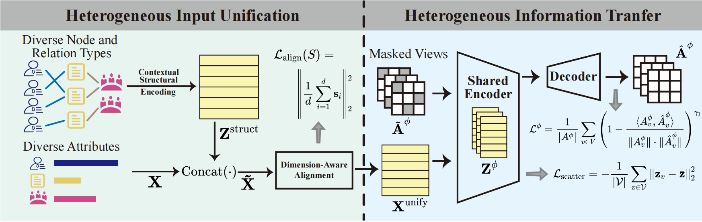

# MUG: Meta-path-aware Universal Heterogeneous Graph Pre-Training

Pytorch official implementation of **MUG**, a universal pre-training framework for heterogeneous graphs.

## Overview

MUG is designed to learn transferable representations across heterogeneous graphs with different node types, relation types, and feature spaces.  
The framework contains two key parts:

- **Heterogeneous Input Unification**  
  MUG first builds contextual structural embeddings from meta-path-guided neighborhoods, then concatenates them with the original node attributes, and finally aligns them into a shared input space through a dimension-aware encoder.

- **Heterogeneous Information Transfer**  
  MUG applies a shared encoder over multiple masked meta-path views and optimizes the model with meta-path reconstruction and global regularization objectives.

For the complete method, please refer to the paper.

## Framework


## Repository Structure

```bash
.
├── main.py
├── model.py
├── encoder.py
├── configs.yml
├── log/
├── utils/
└── data/
```

## Requirements
The environment configuration is stored in [`env.yaml`](env.yaml).

## Quick Start

Train MUG on a source dataset (e.g. acm) and run node classification evaluation:
```bash
python main.py --dataset acm
```
## Configuration

Dataset-specific hyperparameters are loaded automatically from `configs.yml`.

## Acknowledgement

Parts of the MUG implementation are based on **HGMAE**:

**Heterogeneous Graph Masked Autoencoders**  
Yijun Tian, Kaiwen Dong, Chunhui Zhang, Chuxu Zhang, and Nitesh V. Chawla  
In *Proceedings of the AAAI Conference on Artificial Intelligence*, 37(8): 9997-10005, 2023.

Official code:  
https://github.com/meettyj/HGMAE

We sincerely thank the authors of HGMAE for making their code publicly available.

## Citation

If you find this repository useful, please cite our paper:

```bibtex
@article{shan2026mug,
  title={MUG: Meta-path-aware Universal Heterogeneous Graph Pre-Training},
  author={Shan, Lianze and Zhao, Jitao and He, Dongxiao and Huang, Yongqi and Feng, Zhiyong and Zhang, Weixiong},
  journal={Proceedings of the AAAI Conference on Artificial Intelligence},
  year={2026}
}
```
